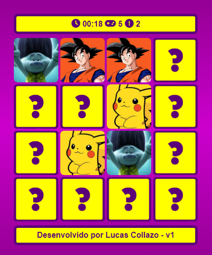

# Jogo da Memória
Seja muito bem vindo(a)!
## Descrição:
Jogo da memória feito em HTML, CSS e Javascript. Projeto dedicado aos meus filhos que amam jogos da memória então fiz um pra eles com as figuras dos seus desenhos favoritos.
Com pouco tempo vago para estudar front-end demorei um pouco para fazer mas ele conta com tela de loading, menu de entrada, animação de virar a carta, emiti sons de flip e match, conta tentativas, erros e marca tempo.
Como mencionei estou com tempo bem escasso para continuar estudando front-end mas pretendo sempre que der implementar uma novidade no joguinho e fazer novos projetos.

